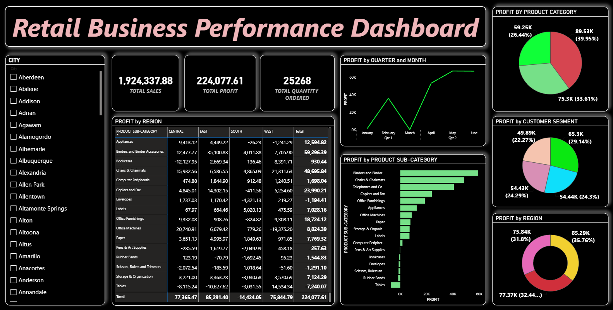

# Retail Business Performance Dashboard

## Overview

This project presents a retail business performance dashboard designed to analyze sales, profit, quantity ordered, regional performance, customer segments, product categories, and monthly profit trends.

## Dashboard Preview

## Key Insights

- Sales and profit performance can be analyzed across different regions.
- Customer segments can be compared to understand their contribution to business performance.
- Product categories can be evaluated based on sales and profitability.
- Monthly trends help identify changes in business performance over time.

## Project Files

- Dashboard project file
- Dashboard screenshot

## Key Areas

- Sales performance
- Profit analysis
- Regional performance
- Customer segment analysis
- Product category performance
- Monthly profit trends
